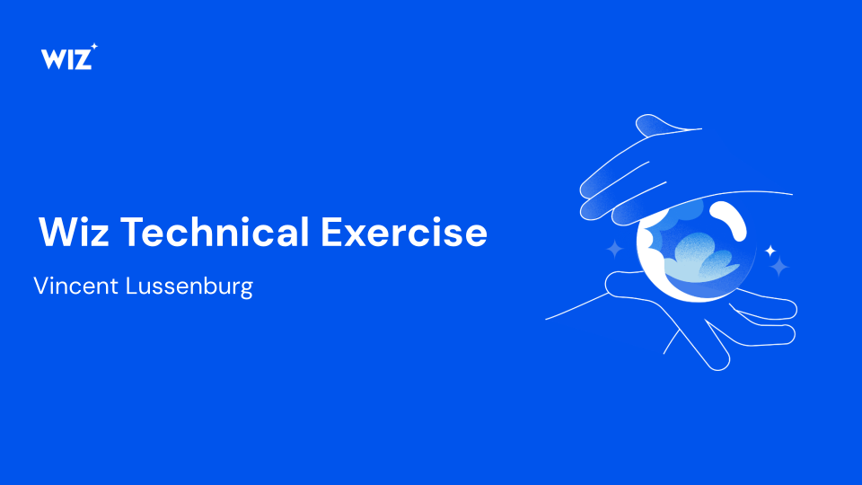

<!-- _class: lead -->



<div style="position: absolute; bottom: 30px; right: 40px; display: flex; gap: 16px; align-items: flex-end;">
  
  
  
</div>

<!--
Welcome, thank you for taking the time.
I'll walk through the architecture, the security misconfigurations,
the controls I implemented, and then do a live demo of the attack chain.
~45 minutes including demo and Q&A.
-->

---


# Architecture Overview


<!--
Two-tier setup in a single VPC.
GKE in the private subnet, MongoDB VM in the public subnet.
The app connects to MongoDB over the pod CIDR.
The VM runs a daily cron backup to a publicly readable GCS bucket.
-->

---


# What I Built

**Application** - "Bucket List" task manager (Node.js + Express + MongoDB)

**Infrastructure** (all Terraform)
- VPC with public + private subnets, Cloud NAT
- GKE private cluster with Binary Authorization
- MongoDB VM with startup script provisioning
- GCS backup bucket with daily cron

**CI/CD Pipelines**
- Container: build, scan, attest, deploy (GitHub Actions)
- Terraform: plan on PR, apply on merge, Checkov IaC scanning

**Security** - 8 intentional misconfigurations + 4 hardening controls

<!--
Everything is IaC — the only manual step was creating the GCP project
and the initial service account keys.
-->

---


# How I Built It — with Claude Code

**38 commits, 12 PRs, ~2,200 lines of code — built in a single day**

| | |
|---|---|
| 20 / 38 commits | co-authored by Claude Code (Opus) |
| 788 lines | Terraform + shell scripts |
| 566 lines | Application (Node.js + Express) |
| 221 lines | CI/CD pipelines (GitHub Actions) |
| 92 lines | Kubernetes manifests |

**My role**: architecture decisions, requirements, review, debugging edge cases
**Claude's role**: implementation, IaC, CI/CD pipelines, app code, docs

<!--
I used Claude Code (CLI) for the entire project.
Claude wrote the terraform, the app, the CI/CD pipelines, and even these slides.
I guided the architecture and reviewed everything.
The whole thing was built in about 8 hours.
-->

---


# Intentional Misconfigurations

| # | Misconfiguration | Risk |
|---|-----------------|------|
| 1 | Ubuntu 22.04 on VM | Outdated OS, 24.04 LTS available since Apr 2024 |
| 2 | MongoDB 6.0 | End of life Aug 2025, no security patches |
| 3 | SSH open to `0.0.0.0/0` | Anyone can attempt SSH to the VM |
| 4 | VM SA: `roles/compute.admin` | VM can create/modify/delete other VMs |
| 5 | GCS bucket: public read | Backup data accessible to anyone on the internet |
| 6 | GCS bucket: public listing | Attackers can enumerate all backup files |
| 7 | K8s: `cluster-admin` binding | App SA has full control over the cluster |
| 8 | NoSQL injection x3 + RCE | Application-level code vulnerabilities |

<!--
These are all deliberate per the exercise spec.
They form a realistic attack surface that chains together.
I'll show the full attack chain in the demo.
-->

---


# Application Vulnerabilities

<div class="columns">
<div>

### NoSQL Injection (x3)

**1.** `GET /api/tasks?status[$ne]=done`
Query param parsed as MongoDB operator

**2.** `POST /api/tasks/search` with `{"$where":"1==1"}`
Body forwarded directly to `find()`

**3.** `PUT /api/tasks/:id` with `{"$set":{"title":"PWNED"}}`
Body forwarded as raw update

</div>
<div>

### Command Injection (RCE)

**4.** `GET /api/tasks/export?format=json;id`

```js
exec(`echo '...' | tee /tmp/tasks.${format}`)
```

`format` interpolated into `child_process.exec()` — full RCE, starting point for attack chain.

</div>
</div>

<!--
The NoSQL injections are common in Express apps that don't sanitize query params.
The RCE is the most critical — it gives shell access inside the container,
which is the starting point for the attack chain.
-->

---


# Security Controls

| Type | Control | Implementation |
|------|---------|----------------|
| **Preventative** | Binary Authorization | GKE only runs images attested after vuln scan |
| **Preventative** | MongoDB firewall | Port 27017 restricted to GKE pod CIDR (`10.4.0.0/14`) |
| **Preventative** | Vuln scan gate | CI blocks deployment if critical CVEs found |
| **Detective** | GKE Security Posture | Workload vulnerability scanning enabled |
| **Detective** | Artifact Registry scanning | Automatic container image vulnerability scanning |
| **Detective** | Control plane audit logs | `APISERVER`, `SYSTEM_COMPONENTS`, `WORKLOADS` |
| **IaC** | Checkov | Static analysis of Terraform, SARIF to GitHub Security tab |

<!--
Binary Auth is the strongest control — even if an attacker builds a malicious image,
it won't run without attestation from our CI pipeline.

The MongoDB firewall is important: even though SSH is open,
the database port is restricted to the pod network only.
-->

---


# DevSecOps Pipelines


<!--
Five stages in the container pipeline.
The vuln scan waits up to 10 minutes for Artifact Registry to index the image.
If any critical CVEs, the pipeline fails and the image is never attested or deployed.
The terraform pipeline runs Checkov in parallel with plan/apply.
-->

---


# Attack Chain


<!--
This is the full attack chain I'll demonstrate live.
Step 1: exploit the command injection to get a shell in the container.
Step 2: the pod's service account has cluster-admin, so we can read all secrets.
Step 3: create a privileged job that uses the VM's compute.admin permissions.
Step 4: SSH directly to the MongoDB VM. Game over.
-->

---


# Live Demo

<iframe src="output/attack-chain-demo.svg" style="width:100%;height:480px;border:none;border-radius:8px;"></iframe>

<!--
This is an animated recording of the attack chain.
I'll also do it live if time permits.
Steps: RCE via command injection → steal SA token → kubectl secrets → inject SSH key → SSH to VM → game over.
-->

---


# Business Risks

- **Full database access** — read, modify, delete all data
- **Credential theft** — MongoDB admin password, GCP SA keys
- **Lateral movement** — `compute.admin` allows pivoting to other VMs
- **Data exfiltration** — public GCS bucket exposes backups
- **Cluster takeover** — `cluster-admin` = full control of all workloads

A single app vulnerability chains through misconfigured RBAC and IAM to give **full infrastructure access**.

<!--
The key point: a single application vulnerability (command injection)
chains through misconfigured RBAC and IAM to give full infrastructure access.
This is exactly the kind of attack path that Wiz excels at detecting.
-->

---


# Value Wiz Would Provide

| Capability | What it catches |
|-----------|----------------|
| **Attack path analysis** | Visualizes the RCE → token → SSH chain end-to-end |
| **Runtime visibility** | Detects anomalous exec calls, token access, lateral movement |
| **Misconfiguration detection** | Flags `cluster-admin` binding, public GCS, open SSH |
| **Vulnerability scanning** | Identifies MongoDB 6.0 EOL, Ubuntu 22.04 outdated packages |
| **Identity analysis** | Highlights `compute.admin` on VM SA as overly permissive |
| **Compliance** | Maps findings to CIS benchmarks, SOC2 controls |

Wiz sees across the full stack — cloud, Kubernetes, application — and connects the dots that individual tools miss.

<!--
The key differentiator: most tools find individual issues.
Wiz shows how they chain together into an actual attack path.
That's what makes the prioritization possible.
-->

---


# Challenges & Adaptations

| Challenge | Solution |
|-----------|----------|
| GCP metadata escapes `!` to `\!` | Diceware-style passwords (no special chars) via `templatefile()` |
| Binary Authorization setup | Complex IAM chain: KMS key, attestor, note, policy + correct roles |
| `roles/editor` lacks KMS access | Added `cloudkms.viewer` + `cloudkms.publicKeyViewer` for terraform SA |
| Provider cache platform mismatch | Separate `.terraform/` dirs for host (ARM) vs Docker container (AMD64) |
| VM boot disk image drift | `lifecycle { ignore_changes }` to prevent VM recreation |
| Vuln scan timing in CI | Polling loop (up to 10 min) waiting for Artifact Registry indexing |

<!--
The GCP metadata issue cost me real debugging time — passwords with
special characters got mangled by the metadata service.
Binary Auth was the most complex piece — lots of moving parts
between KMS, Container Analysis, and the attestor.
-->

---


# What I'd Do Differently

**With more time:**
- Network policies to restrict pod-to-pod traffic
- Separate environments (dev/staging/prod) with promotion gates
- Monitoring dashboards for attack indicators

**Design choices I'd reconsider:**
- MongoDB on VM vs. managed Atlas — chose VM per exercise requirements
- Single zone — would use regional GKE for production

<!--
The biggest improvement would be Workload Identity — SA key files
are a known anti-pattern. Also, network policies would limit the
blast radius even with cluster-admin.
-->

---

# Bonus: How These Slides Are Made

**Marp** (Markdown → HTML/PDF/PPTX) with a multi-stage Docker build:

| Stage | What it does |
|-------|-------------|
| `diagrams-stage` | Python `diagrams` + Graphviz → architecture diagram |
| `mermaid-stage` | Mermaid CLI + Chromium → pipeline & attack chain flowcharts |
| `asciinema-stage` | `svg-term-cli` → animated terminal demo from `.cast` recording |
| `backgrounds-stage` | Ideogram API → AI-generated slide backgrounds |
| `qrcode-stage` | Python `qrcode` → QR codes for PDF/PPTX/slides links |
| `marp-stage` | Marp CLI + Chromium → HTML, PDF, PPTX |

**CI/CD**: push to branch → GitHub Actions builds → artifacts + GitHub Pages

Everything is code. Even the slides about the slides.

<!--
Yes, I used Claude Code to build the slide pipeline too.
The entire thing — diagrams, backgrounds, QR codes, exports — runs
in a single docker build command with no local dependencies.
-->

---


# Resources

**GCP** — Binary Authorization, GKE Security Posture, Artifact Registry scanning

**Tools** — Terraform, Checkov, Kustomize, GitHub Actions

**Repo**: github.com/vlussenburg/wiz-assignment-vincentlussenburg

<div style="position: absolute; bottom: 30px; right: 40px; display: flex; gap: 16px; align-items: flex-end;">
  
  
  
</div>

<!--
Happy to take questions!
The repo is available if you want to explore the code in detail.
-->
